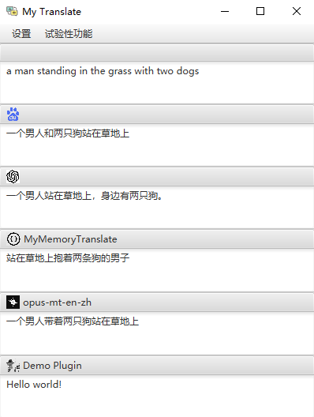

My-Translate4J
==============

My-Translate4J 是Windows桌面客户端翻译软件。目前还在持续开发和优化阶段。

## 运行
运行根路径下的 [run.bat](run.bat)



## 使用
快捷键 Alt+S 进行截图翻译，Alt+Z 对鼠标选中的文本进行翻译。请注意检查是否有快捷键冲突。

## 扩展
目前支持插件/扩展功能，基于 SPI 实现。扩展 SDK 和扩展 demo 可在以下链接中找到：

*   插件 SDK：[https://github.com/youdontknow-hash/my-translate4J-plugin-api](https://github.com/youdontknow-hash/my-translate4J-plugin-api)
*   插件 demo：[https://github.com/youdontknow-hash/my-translate4J-plugin-api-demo](https://github.com/youdontknow-hash/my-translate4J-plugin-api-demo)

试验性功能
-----

### 图片字幕翻译/Image Captioning


如何开始
----
### 安装百度PaddleOCR和PaddlePaddle
```pycon
pip install paddleocr
pip install paddlepaddle
```
## 以下为可选
### Helsinki-NLP/opus-mt-en-zh 模型

从以下链接下载所有文件并放入项目根目录下的 `opus-mt-en-zh-local` 文件夹中：

[https://huggingface.co/Helsinki-NLP/opus-mt-en-zh/tree/main](https://huggingface.co/Helsinki-NLP/opus-mt-en-zh/tree/main)

### Salesforce/blip-image-captioning-base 模型

从以下链接下载所有文件并放入项目根目录下的 `blip-image-captioning-base` 文件夹中：

[https://huggingface.co/Salesforce/blip-image-captioning-base/tree/main](https://huggingface.co/Salesforce/blip-image-captioning-base/tree/main)

### baidu 翻译 API

在系统设置中填写已申请的 API Key 和 Secret Key：

[https://api.fanyi.baidu.com/doc/12](https://api.fanyi.baidu.com/doc/12)

### ChatGPT API

在系统设置中填写已申请的 token：

[https://platform.openai.com/account/api-keys](https://platform.openai.com/account/api-keys)


贡献
--

欢迎通过创建插件或改进现有功能为 My-Translate4J 做出贡献。有关插件开发的更多信息，请参考插件 SDK 和插件 demo。

许可证
---

本项目基于 [MIT 许可证](LICENSE)。

---

My-Translate4J
==============

My-Translate4J is a Windows desktop client translation software based on JDK17, Spring Boot 3.0.6, Python 3.10, PowerShell, and JavaFX. It is currently in the development and optimization phase and is suitable for developers with relevant knowledge. By default, it integrates Baidu translation, ChatGPT, MyMemory, blip-image-captioning-base, and opus-mt-en-zh.

The software also supports plugin/extension functionality based on SPI implementation. The plugin SDK and plugin demo can be found at the following links:

*   Plugin SDK: [https://github.com/youdontknow-hash/my-translate4J-plugin-api](https://github.com/youdontknow-hash/my-translate4J-plugin-api)
*   Plugin demo: [https://github.com/youdontknow-hash/my-translate4J-plugin-api-demo](https://github.com/youdontknow-hash/my-translate4J-plugin-api-demo)

The OCR image recognition function is based on the Tess4J project. The recognition of English is quite good, but the recognition rate for Chinese is not high. The relevant models need to be downloaded and placed in the tessdata folder.

Use the shortcut Alt+S for screenshot translation and Alt+Z for translating selected text. Please check for possible shortcut conflicts.

Experimental Features
---------------------

### Image Captioning Translation


Getting Started
---------------

### Install JavaFX

As the new versions of JDK have separated JavaFX related libraries, you need to manually download and import them into the project. Add the following VM options at runtime:


```css
--module-path javafx_path/lib --add-modules javafx.controls,javafx.fxml
```

### Helsinki-NLP/opus-mt-en-zh Model

Download all files from the following link and place them in the `opus-mt-en-zh-local` folder in the project root directory:

[https://huggingface.co/Helsinki-NLP/opus-mt-en-zh/tree/main](https://huggingface.co/Helsinki-NLP/opus-mt-en-zh/tree/main)

### Salesforce/blip-image-captioning-base Model

Download all files from the following link and place them in the `blip-image-captioning-base` folder in the project root directory:

[https://huggingface.co/Salesforce/blip-image-captioning-base/tree/main](https://huggingface.co/Salesforce/blip-image-captioning-base/tree/main)

### Baidu Translation API

Enter the applied API Key and Secret Key in the system settings:

[https://api.fanyi.baidu.com/doc/12](https://api.fanyi.baidu.com/doc/12)

### ChatGPT API

Enter the applied token in the system settings:

[https://platform.openai.com/account/api-keys](https://platform.openai.com/account/api-keys)

### OCR Image Recognition Model

Download the relevant models from the Tesseract official website and place them in the project's `tessdata` folder.

Contributing
------------

You are welcome to contribute to My-Translate4J by creating plugins or improving existing features. For more information on plugin development, please refer to the plugin SDK and plugin demo.

License
-------

This project is licensed under the [MIT License](LICENSE).
